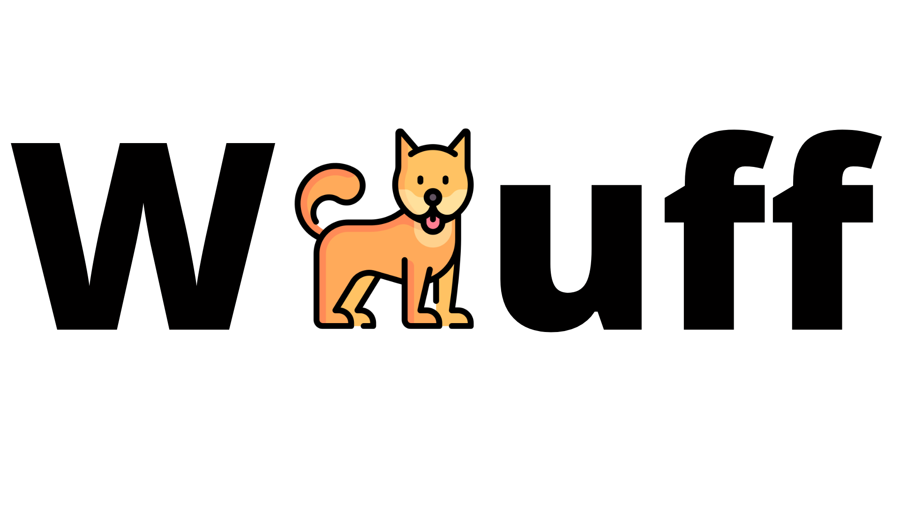

## O projekte
  
Jednoduchá webová aplikácia pre správu útulku. Bežný užívateľ si môže vytvoriť účet, prezrieť jednotlivé psy a ich dostupnosť a v prípade záujmu poslať žiadosť o adopciu daného psa. Taktiež môže posielať kontaktné správy pre adminov. Admin si môže prezerať registrovaných zákazníkov a meniť ich údaje, psov, plemená a kontaktné správy. Má možnosť pridávať nových psov a upravovať ich.  

### Použité entity a možné operácie nad nimi
- **Používateľ** - CRUD
- **Adresa** - CRUD
- **Pes** - CRUD
- **Plemeno** - CRD
- **Kontaktná správa** - CRD
- **Žiadosť o adopciu** - CRD

### Použité nástroje

HTML, CSS, Boostrap, Materialize, JS, Laravel

